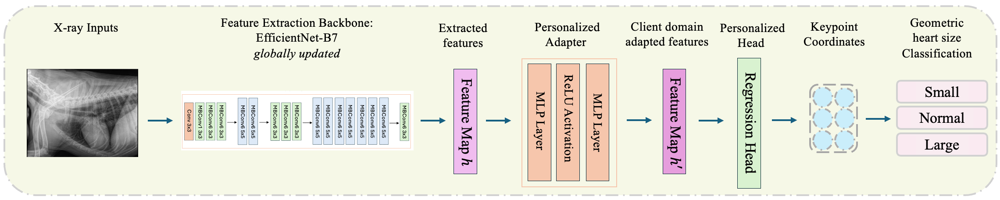
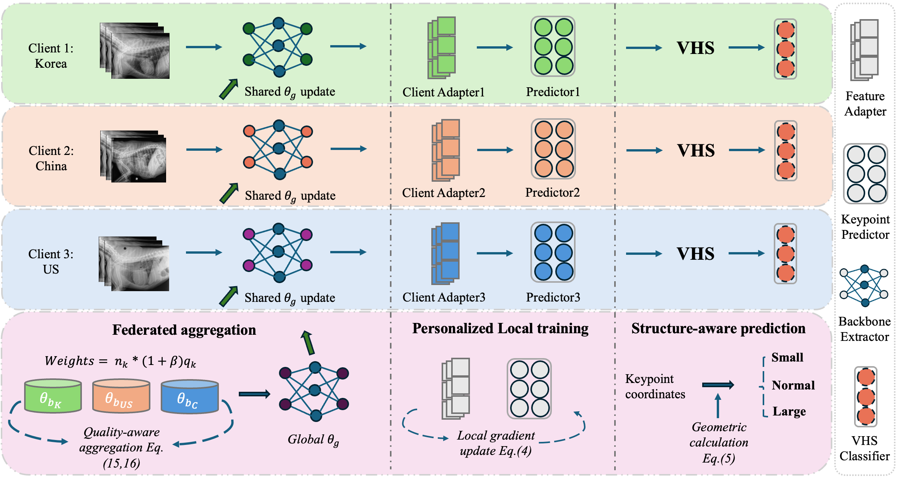
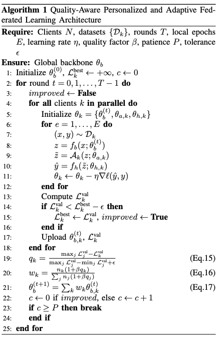
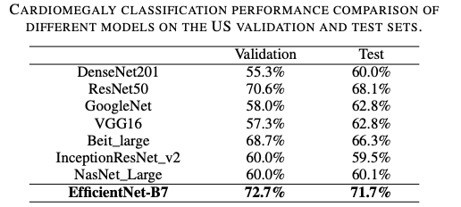
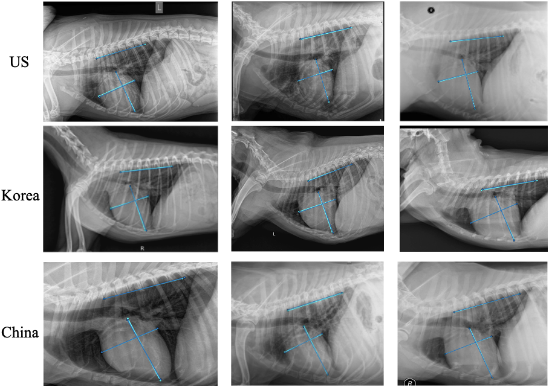

# Personalized and Adaptive Federated Learning for Canine Cardiomegaly Keypoint Prediction

## PAFL Model Architecture

- We develop the PAFL model for Canine Cardiomegaly Keypoint Prediction. 

    
    
Proposed client architecture for the VHS keypoint prediction model.

    
    
Proposed personalized and adaptive federated learning architecture for quality-aware aggregation.

## Algorithm of PAFL

    
    
The Training Algorithm.

## Results of different backbone networks

In our paper, we compared the performance of different models, including CNNs and vision transformers, as feature-extraction backbones for our proposed federated learning architecture on the keypoint prediction task. The following table presents comparison statistics for the models, using classification accuracy, which derivatively reports the model's performance in predicting keypoint coordinates. Among the selected models, EfficientNet-B7 stands out as the best-performing model for predicting keypoints, calculating the VHS score, and predicting canine cardiomegaly, achieving validation accuracy of 72.7% and test accuracy of 71.7%. Based on these results, EfficientNet-B7 is selected as the backbone for training our subsequent federated learning framework. 

    
    
Backbone network selection 

## Results of Prediction Comparisons

The following figure visualizes the model's performance on VHS keypoint prediction. It displays three random X-ray image coordinate predictions from each dataset, using models with centralized weights at the optimal 25th round; blue lines indicate ground-truth labels, and cyan lines indicate predictions. From the figure, it is clear that the blue and cyan lines are almost overlapped, indicating the model performs well in predicting the VHS keypoint coordinates, and thereby the derived VHS calculation and cardiomegaly classification.

    
    
 Results demonstration of predicted keypoints after applying federated learning for three datasets.

